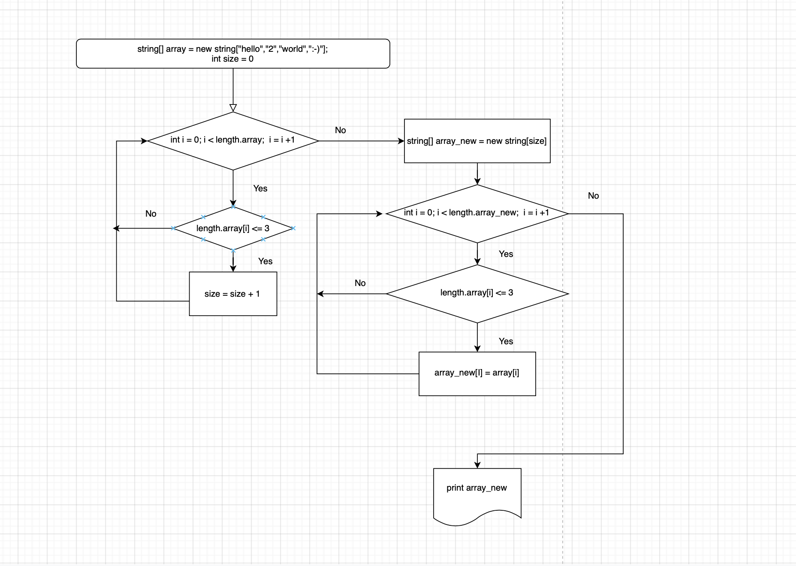

# final_project
Итоговый проект по 1-ой четверти обучения

## Алгоритм выполнения задачи
1. Определяем размер изначального массива (метод ***GetNumberFromUser***)
2. Вводим значения в массив (метод ***FillArray***)
3. Определяем кол-во символов в значении, которое является границей для дальнейшего вывода
4. Считаем количество значений в изначальном массиве, удовлетворяющих условию, используем его для размера нового массива (метод ***GetMaxBorder***)
5. Записываем значения, удовлетворяющие условиям, в новый массив (метод ***FillArrayWithBoard***)
6. Выводим результат на экран

## Блок-схема
